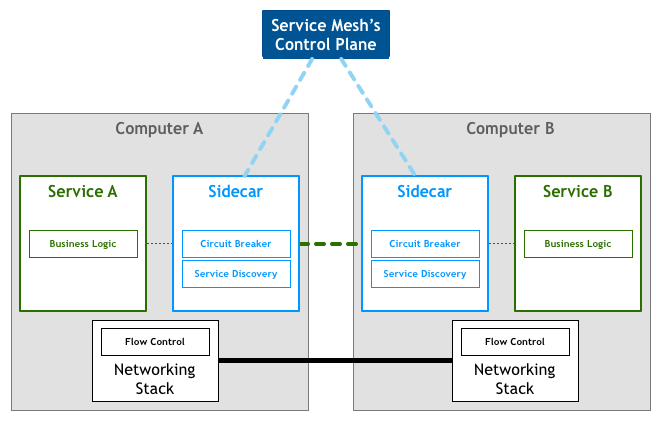
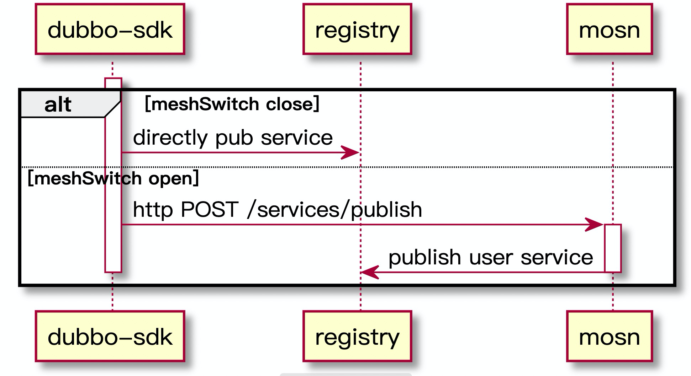
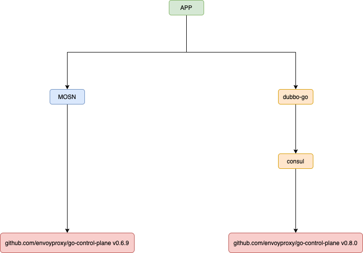

## Service Mesh 简介

Service Mesh 本身的理念并不复杂，就是将现代微服务应用的功能性与非功能性需求进行分离，并将非功能性需求下沉到应用的外部模块，从而使应用模块可以尽量聚焦于业务，不用关心诸如：服务发现、限流、熔断、tracing 这类非业务需求。下沉之后，相关的 Service Mesh 模块可以交由基础架构团队进行维护，使基础设施和业务能够完成解耦。

Service Mesh 设计一般划分为两个模块，控制面和数据面。可以通过下图来理解相应的职责：



对于应用来说，所有流量都会经过 Service Mesh 中的数据面进行转发。而能顺利转发的前提：数据面需要知道转发的目标地址，目标地址本身是由一些业务逻辑来决定的(例如服务发现)，所以自然而然地，我们可以推断控制面需要负责管理数据面能正常运行所需要的一些配置：

* 需要知道某次请求转发去哪里：服务发现配置
* 外部流量进入需要判断是否已经达到服务流量上限：限流配置
* 依赖服务返回错误时，需要能够执行相应的熔断逻辑：熔断配置

开源界目前比较有名的主要是 istio，envoy 和 linkerd 这几个项目，今天我们来介绍一下蚂蚁推出的 Service Mesh 数据面项目：MOSN。

## MOSN 简介

MOSN 是蚂蚁集团出品的用 Go 语言实现的 Service Mesh 数据面，在蚂蚁内部已大规模落地，在开源过程中我们了解到外部用户有较多的 dubbo 用户，这些 dubbo 用户也希望能够享受 Service Mesh 社区的发展红利。同时可以针对自己公司的特殊业务场景，对 Service Mesh 的数据面进行一定的扩展。

谈到扩展，MOSN 使用 Go 编写的优势就体现出来了。相比 C++，Go 语言通过自带的内存分配器与 GC 实现了一定程度的内存安全，解放了程序员的心智。相比 C++ 编写的 envoy，无论是编程和问题定位都要轻松不少。

MOSN 同时提供了强大的 XProtocol [协议扩展框架](https://mosn.iodocs/concept/multi-protocol/)，用户可以根据自己的需求编写自定义协议解析。如果你使用的是 SOFA/Dubbo/HTTP/HTTP2，那么 MOSN 已经为你准备好了现成的实现。开箱即用。

为了满足社区的需求，从今年 4 月开始，MOSN 社区与 dubbo-go 社区进行了深入的交流与合作。可能还有些同学对 dubbo-go 不太了解，简单介绍一下。

## dubbo-go 简介

Dubbo 是阿里巴巴出品一个非常优秀的 Java RPC 框架，相比其它框架，有较为全面的服务治理功能。

dubbo-go 是 dubbo 的 Go 语言版本，该项目已进入 apache 一年有余，开发社区很活跃，版本发布节奏较快。功能上也基本和 dubbo 的 Java 版都对齐了。


对于喜欢 dubbo 的 gopher 来说，dubbo-go 是个不错的选择。使用它来构建整个公司的服务框架，省时省心。

## MOSN + dubbo-go 双剑合璧

Service Mesh 能够给微服务的整体架构带来很多好处，然而业界提供的全家桶方案不一定能很好地在企业内落地，有下面一些原因：

* 要求数据面和控制面一起上线，早期 istio 因为设计问题，有众多模块。会大幅增加企业的运维负担。
* 企业上 mesh 一定是渐进部署，不可能一次性让所有服务全部上。这样就会有在 mesh 中的应用和非 mesh 中的应用需要能够互通的需求。

蚂蚁的 Service Mesh 落地过程相对较为成功，值得参考。在内部落地时，首先只落地数据面，这样运维负担较轻，同时出问题时也容易排查。

但只落地数据面的话，有些控制面的功能我们就没有了，比如服务发现、路由配置订阅等等。因此在 MOSN 中，又额外对这些功能进行了支持(相当于目前的数据面单模块同时承载了数据面和控制面的部分功能)。当数据面稳定落地之后，再进行控制面的落地相对来说负担就小很多了。

上面的是蚂蚁内部的情况，在社区内，MOSN 借助 dubbo-go 的能力，已经实现了服务发现功能，用户应用启动、退出时需要和 MOSN 进行简单的交互，以完成服务的发布和订阅功能，下面是发布流程：



在应用启动时，访问本地的 MOSN http 接口，告知需要将本地的服务发布出去，MOSN 收到请求后对外发布 MOSN 的 ip 和端口到注册中心。这样监听本服务的 consumer 便可以从注册中心收到服务变更的通知，并将本实例加入到相应的 provider 列表。当应用退出时，需要主动进行 unpub。

这种情况下的改造成本：

1. 对于业务方来说，只需要升级 sdk。
2. 对于 sdk 维护方，在执行 sub/pub/unsub/unpub 时，需要增加一个开关判断，开关打开时，说明本实例已上 Service Mesh。请求相应的本地 MOSN 接口。
3. 对于 mesh 提供方，只要做好配置和部署就可以了。

接入 MOSN 后，mesh 化和非 mesh 化的应用可以互通：


当然，开发过程也并不是一帆风顺的。在我们刚开始使用 dubbo-go 时，便遇到了 dubbo-go 的依赖与 MOSN 的依赖有冲突的问题：



Go 语言的 go mod 语义会“自作聪明”地认为 0.y.z 的外部依赖都是彼此兼容的，然而我们从 semver 规范可以学习到：

> Major version zero (0.y.z) is for initial development. Anything MAY change at any time. The public API SHOULD NOT be considered stable.

0.y.z 只是用来做初始的开发，本身 API 的变化就是很频繁的，依赖管理工具不应该自动去升级这些依赖。但是 Go 社区的人有不少人坚持 go mod 的行为正确，并且祭出 MVS 算法，表示碰到问题的只是不懂 Go 的哲学。

当前 Go 的依赖管理使得两个大项目发生依赖冲突时，比较难处理，我们只能根据实际情况去 go.mod 中去写一些 replace 逻辑，来锁定外部依赖库版本。

除了依赖问题以外，dubbo-go 最初的设计大量使用了 init 函数。init 函数用来实现一些初始化和依赖注入确实比较方便，但如果一个项目中的模块会被其它外部项目依赖时，init 则可能给我们造成麻烦，举个简单的例子：

```go
package x
var GlobalMap = map[string]int{}

package a
func init() {
    x.GlobalMap["x"] = 1
}

package b
func init() {
    x.GlobalMap["x"] = 2
}
```

如果我们在某个包中同时依赖 a 和 b，那么下面的两种写法，得到的结果是不一样的：

```go
package show
import (
    "a"
    "b"
    "x"
)

func main() {
    println(x.GlobalMap["x"])
}
```

```go
package show
import (
    "b"
    "a"
    "x"
)
func main() {
    println(x.GlobalMap["x"])
}
```

为了避免这些隐式的 init 行为，我们实际上是 fork 了 dubbo-go 并进行了少量修改的。当然，改动并不多，未来如果 dubbo-go 有更好的模块化方法的话，我们也可以很轻松地迁移回直接依赖 dubbo-go。

在 MOSN 集成 dubbo-go 的过程中，dubbo-go 社区的老哥们给予了我们大量的支持，[贤哥（@zouyx）](https://github.com/zouyx) 帮助我们在 dubbo-go 中实现了之前不支持的 unsub/unpub 功能，并帮助我们解决了很多技术方面的问题。dubbo-go 社区负责人[于雨（@alexstocks）](https://github.com/alexstocks)也在开发过程中提供了大量的信息和技术支持。有这两位的支持，MOSN 和 dubbo 的集成才顺畅无比，否则的话要多走很多弯路。

## 其它选择

除了本文提到的 MOSN + dubbo-go 集成方式，多点的陈鹏同学为我们提供了另一种思路进行集成，本文就不展开了，感兴趣的同学可以参考文末的资料。

## 作者简介

曹春晖，开源 MOSN committer，@cch123，蚂蚁集团系统部技术专家，主攻 Service Mesh 方向。个人技术网站 xargin.com，和他人合著《Go 语言高级编程》。

## 参考资料

1. [什么是Service Mesh（服务网格）](https://jimmysong.io/blog/what-is-a-service-mesh/)
1. [MOSN 多协议机制解析](https://mosn.iodocs/concept/multi-protocol)
1. [多点生活在 Service Mesh 上的实践](https://mp.weixin.qq.com/s/mhHnH6ZDPPs6Gr0a20WGOw)
